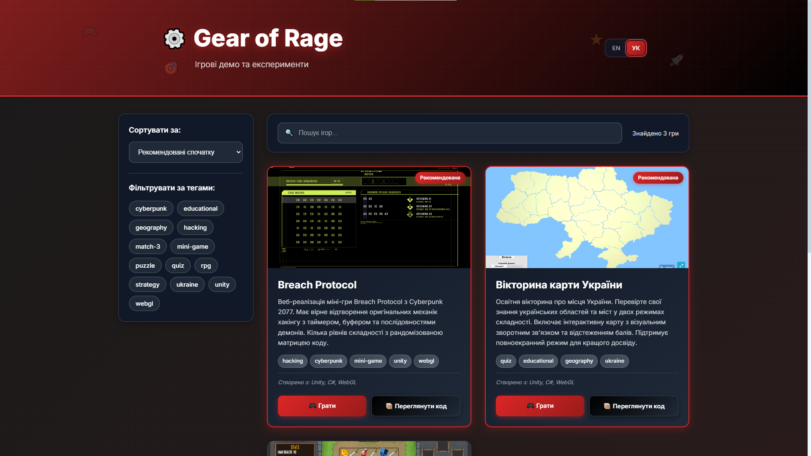

<div align="center">

# 🎮 Gear of Rage Games

[](https://gearofrage.github.io/GearOfRage-s-Games)
[](https://www.i18next.com/)

**A gaming portfolio showcasing creative game demos and experiments**

_Built by Gear of Rage with_ ❤️

---



</div>

## 🚀 Live Demo

**[🌐 View Portfolio →](https://gearofrage.github.io/GearOfRage-s-Games)**

## 🛠️ Tech Stack

- **Frontend:** React 19, CSS3, HTML5
- **Internationalization:** React i18next
- **Build Tool:** Create React App
- **Deployment:** GitHub Pages
- **Game Engine:** Unity WebGL
- **Languages:** JavaScript, C#

## 🏃‍♂️ Quick Start

```bash
# Clone the repository
git clone https://github.com/GearOfRage/GearOfRage-s-Games.git

# Navigate to project directory
cd GearOfRage-s-Games

# Install dependencies
npm install

# Start development server
npm start
```

Open [http://localhost:3000](http://localhost:3000) to view in your browser.

## 📜 Available Scripts

| Command          | Description               |
| ---------------- | ------------------------- |
| `npm start`      | 🔥 Run development server |
| `npm run build`  | 📦 Build for production   |
| `npm run deploy` | 🚀 Deploy to GitHub Pages |
| `npm test`       | 🧪 Run test suite         |

## 🌍 Internationalization

This project supports multiple languages:

- 🇺🇸 **English** - Full UI translation
- 🇺🇦 **Ukrainian** - Complete localization

Language files are located in `src/i18n/locales/`:

- `en.json` - English translations
- `uk.json` - Ukrainian translations

## 📁 Project Structure

```
src/
├── components/          # React components
│   ├── GameCard.js     # Individual game display
│   ├── Header.js       # Navigation header
│   ├── SearchBar.js    # Search functionality
│   └── ...
├── data/
│   └── games.js        # Game information data
├── i18n/
│   ├── i18n.js         # i18next configuration
│   └── locales/        # Translation files
└── App.js              # Main application component
```

## 📄 License

© 2020-2025 Gear of Rage. All rights reserved.

---

<div align="center">

**Made with ❤️ by [Gear of Rage](https://github.com/GearOfRage)**

[](https://github.com/GearOfRage)

</div>
